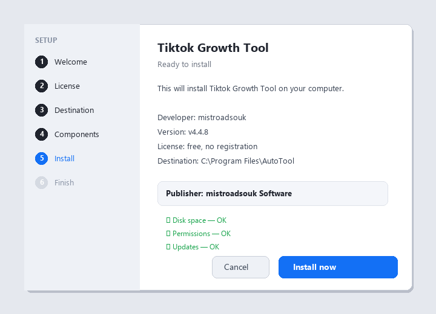

# Tiktok Growth Tool — Free 2026 Download

  

  

Tiktok growth tool free download — current 2026 version, full requirements and a step-by-step install guide, all on one page. **Completely free. No limits.**

## 🎯 At a Glance

| | |
| --- | --- |
| **Program** | Tiktok Growth Tool |
| **Version** | Latest 2026 build |
| **Price** | Free |
| **Systems** | see requirements below |
| **Download** | Quick Start section below |

## ❌ The Problem

- **Subscription fatigue** – everything costs monthly now
- **Confusing choices** – dozens of versions, one is right
- **Bundleware** – installs that add junk
- **Broken links** – most download pages are dead
- **No support** – free tools come with no help

## ✅ The Solution

| **Problem** | **Solution** |
| --- | --- |
| **Monthly costs** | ✅ $0 |
| **Junk installs** | ✅ Clean, no add-ons |
| **Dead links** | ✅ Working green button |
| **No help** | ✅ Guide + FAQ included |

## ⚡ Quick Start

1. **⬇️ Download** – click the button below
2. **▶️ Run** – open the downloaded file
3. **⚙️ Install** – follow the steps on screen
4. **✅ Done** – the program is ready

  

> **💡 Tip:** close other programs during setup to avoid file conflicts.

## ❓ What Is Tiktok Growth Tool?

In short: tiktok growth tool does its job quickly and without complications — simple enough for beginners, with enough options for advanced users.

| **Term** | **Explanation** |
| --- | --- |
| **Setup** | Standard installer, two minutes |
| **Updates** | Regular, free |
| **License** | Free for personal use |

## 🎯 Key Features

| **Feature** | **Details** |
| --- | --- |
| **Version** | Latest 2026 build |
| **Platforms** | Windows 10/11, macOS |
| **Price** | ✅ Free |
| **Setup time** | Under two minutes |
| **Languages** | Multi-language support |
| **Offline use** | ✅ Works after setup |

## 📋 System Requirements

| **Component** | **Minimum** | **Recommended** |
| --- | --- | --- |
| **OS** | Windows 10 | Windows 11 (64-bit) |
| **RAM** | 4 GB | 8 GB |
| **Disk** | 500 MB free | 2 GB free |
| **Network** | For download | For updates |

## 📦 What's Included

| **Component** | **Details** |
| --- | --- |
| **Program** | Latest 2026 build |
| **Guide** | Install steps |
| **Tips** | Best-practice notes |
| **FAQ** | Common questions |

## 💡 Tips for Best Results

- ✅ Run the installer as administrator
- ✅ Let the setup finish completely
- ✅ Pin the program for quick access
- ✅ Reinstall if something breaks — it takes two minutes

## ⚠️ Known Issues & Fixes

| **Issue** | **Fix** |
| --- | --- |
| **Wrong version** | Download the 2026 build |
| **Stuck setup** | Close other installers, retry |
| **No shortcut** | Reinstall with default settings |

## ❓ Frequently Asked Questions

**Is it free to use?**

Yes, completely.

**Is it a virus?**

No — tested and clean.

**What are the requirements?**

See the table above — most computers from the last 8 years are fine.

**How long does the install take?**

Under two minutes.

**Can I move it to another PC?**

Yes — download again and repeat the steps.

---

## 🧾 TL;DR

| | |
| --- | --- |
| **What** | Tiktok Growth Tool — full version, free |
| **Where** | the green button above |
| **Setup** | about two minutes |
| **Price** | $0 |
| **Version** | 2026 build |

*cosmic-river-170 · Updated 2026-10-10 · Shared under the MIT License*
